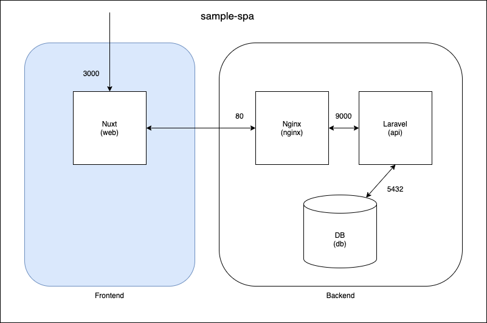

## 概要
[sample-spa-laravel](https://github.com/nagi125/sample-spa-laravel)のFrontend  
SPAの確認をするための最低限の実装にしてあります。

## 構成図


## 初期セットアップ
```
$ docker-compose build
$ docker-compose up -d
$ docker-compose exec web yarn install
$ docker-compose exec web yarn dev
```

## 各種コマンド
```
$ docker-compose exec web yarn dev
```
